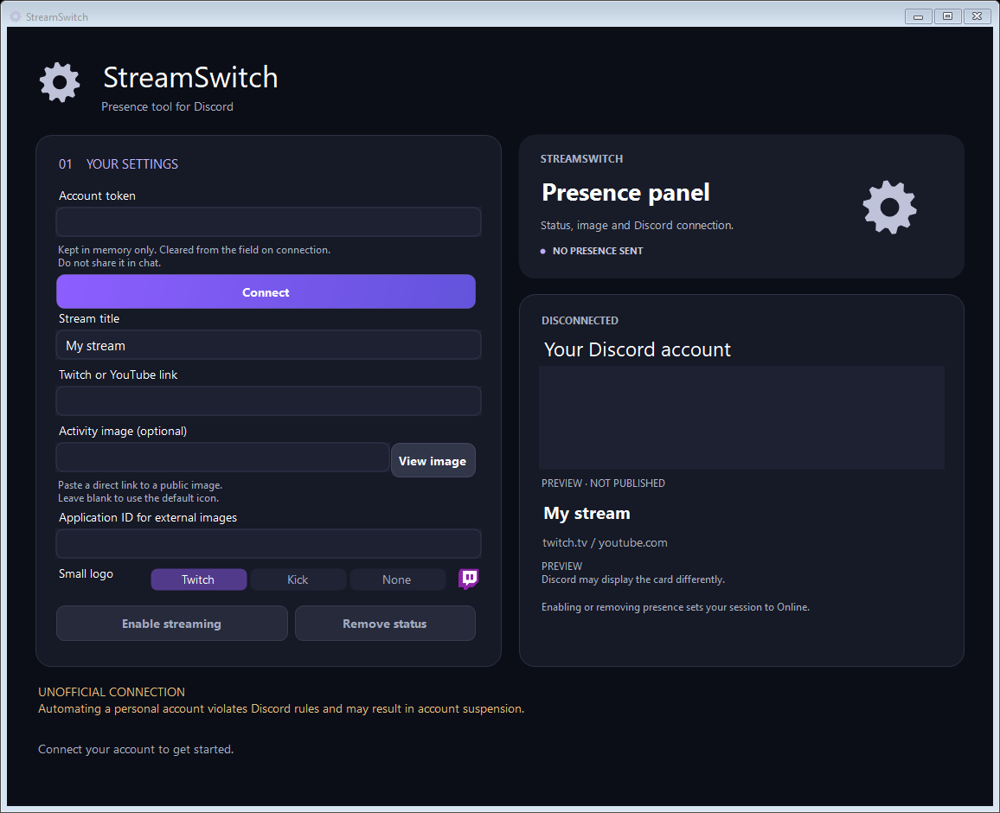

# StreamSwitch

**A Windows desktop tool for managing Discord streaming presence. Developed by Oxigeno.**

StreamSwitch lets you configure a streaming title, a Twitch or YouTube link, an optional image, and a small Twitch or Kick logo. It includes a local preview, a gear icon, and animated controls. The interface and messages are in English.



## Important limitation

This project uses an unofficial personal-account connection. Automating a personal account violates Discord's rules and may result in account suspension. StreamSwitch is not affiliated with Discord, Twitch, or Kick. It does not start a broadcast, and it cannot guarantee that Discord will display a purple streaming indicator or render every image. A successful send means the request was sent, not that its appearance was verified.

## Features

- Connect and disconnect from the desktop interface.
- Enable or remove streaming presence with a configurable title and link.
- Preview a public image before sending it.
- Choose Twitch, Kick, or None for the small logo.
- Store non-secret preferences locally.
- Keep the personal token in memory only; it is cleared from the input field when connecting and is not saved by the app.
- Build with the Windows .NET Framework compiler, with no external NuGet packages.

## Requirements

- Windows with .NET Framework 4.8 recommended.
- The .NET Framework C# compiler at `%WINDIR%\Microsoft.NET\Framework64\v4.0.30319\csc.exe` to build from source.
- An Internet connection for Discord and public image URLs.
- A public Discord Application ID if using external images or logos.

## Build and run

1. Download the repository using **Code → Download ZIP**, then extract it to a writable folder. Alternatively, clone the repository with Git.
2. Open the extracted folder and run `build.cmd`.
3. Confirm that `StreamSwitch.exe` was created successfully.
4. Open `StreamSwitch.exe`. Keep the `logos` folder next to it.

The executable is unsigned. Review the source and only run builds from sources you trust. No installation or administrator rights are required for normal use.

For PowerShell users, `build.ps1` provides the same build when local script policy permits it. `build.cmd` does not require changing PowerShell execution policy.

## Configure a presence

1. Close any other running version of StreamSwitch.
2. Enter your own account token in the app's **Account token** field, then select **Connect**. Never paste tokens in issues, screenshots, chat, or source files.
3. Enter a **Stream title** between 2 and 128 characters.
4. Enter a full HTTPS **Twitch or YouTube link**, including the channel or video path. A link does not start a real stream.
5. Optionally paste a direct public HTTPS URL into **Activity image** and select **View image**.
6. If using an external image, enter your application's public **Application ID**.
7. Choose a **Small logo**: Twitch, Kick, or None. The small logo requires a main image. Kick changes the badge only; Kick streaming links are not supported.
8. Select **Enable streaming**. Check the result from another Discord account if needed.

**Remove status** sends a request to clear the activity while keeping the session online. **Disconnect**, or closing the window, attempts to remove the activity and close the connection. Discord may take time to update. Changes have a short cooldown to avoid rapid repeated requests.

## Images and Application ID

The app needs a direct, publicly reachable HTTPS image URL, not a local file path or a webpage containing the image. Local preview accepts images under 5 MB and up to 4096 × 4096 pixels. A working preview does not guarantee that Discord accepts the image.

To obtain an Application ID:

1. Open the [Discord Developer Portal](https://discord.com/developers/applications).
2. Create an application under your own account.
3. Open **General Information** and copy its **Application ID**.
4. Paste that public identifier into StreamSwitch. It is different from a public key, client secret, or token.

External image conversion is performed through Discord. Remote image services can become unavailable, and Discord can reject or cache an image. Twitch and Kick preview assets are included in `logos`; their remote URLs are used for presence images.

## Preferences and privacy

`preferencias.json` stores the title, stream URL, image URL, Application ID, and selected logo next to the executable. The filename is retained for compatibility with earlier versions. It does not store the token. Closing the app ends its in-memory session.

The app contacts Discord for authentication and presence operations, and image hosts for image previews. Tokens are sent only to Discord by the connection and image-conversion code. Do not publish preference files or use real credentials in tests. The repository's `.gitignore` excludes preferences, generated executables, and test reports.

## Tests

After building, run:

```powershell
$process = Start-Process .\StreamSwitch.exe -ArgumentList '--self-test','self-test.txt' -Wait -PassThru
Get-Content .\self-test.txt
if ($process.ExitCode -ne 0) { throw 'Tests failed' }

$process = Start-Process .\StreamSwitch.exe -ArgumentList '--ui-test','ui-test.txt' -Wait -PassThru
Get-Content .\ui-test.txt
if ($process.ExitCode -ne 0) { throw 'UI checks failed' }
```

The simulated tests cover validation, gateway behavior, image conversion, and logo selection without a real Discord connection or credential. UI checks cover animations, selection rendering, the embedded icon, and window dimensions. They do not verify the appearance of a real Discord profile. GitHub Actions builds and runs the simulated tests on Windows.

## Troubleshooting

| Problem | What to check |
| --- | --- |
| “StreamSwitch is already open” | Close the previous instance before starting another build. |
| Authentication rejected | Re-enter your own token only in the app. Do not post it when reporting an issue. |
| Preview works but Discord has no image | Check the Application ID, direct image URL, and the conversion error message. Discord rendering is not verified by the app. |
| Small logo missing | Add a main image, select a logo, and resend the presence. |
| Controls temporarily disabled | Wait for the connection operation or presence cooldown to finish. |
| Compiler not found | Check the .NET Framework installation and compiler path listed above. |
| Preferences not saved | Extract the project into a folder where your user account can write. |

## Project layout

| File | Purpose |
| --- | --- |
| `StreamSwitch.cs` | Main window, validation, session, and gateway transport |
| `ImageAssets.cs` | Image conversion and remote badge URLs |
| `ModernUi.cs` | Gear artwork, cards, fields, logo selector, and animated panel |
| `AppButton.cs` | Animated button control |
| `SelfTests.cs` | Simulated backend tests and UI smoke checks |
| `build.cmd` / `build.ps1` | Windows build scripts |
| `logos/` | Local badge preview images |

## Contributing

See [CONTRIBUTING.md](CONTRIBUTING.md) for the development workflow and [SECURITY.md](SECURITY.md) for handling sensitive reports. Keep changes focused, describe their user-visible effect, and run the simulated tests before submitting a pull request.

## Credits

**Developer: Oxigeno.** Third-party artwork and brand references are listed in [THIRD_PARTY_NOTICES.md](THIRD_PARTY_NOTICES.md).

## License

Original source code is available under the [MIT License](LICENSE), copyright (c) 2026 Oxigeno. Third-party artwork is excluded; see [THIRD_PARTY_NOTICES.md](THIRD_PARTY_NOTICES.md).

## Previous versions

See the [version archive](CHANGELOG.md) for seven historical editions and their changes. Download their executable-and-source packages from [Releases](https://github.com/TaureO2/StreamSwitch/releases). Historical interfaces are in Spanish; this main branch contains the newer English edition.
